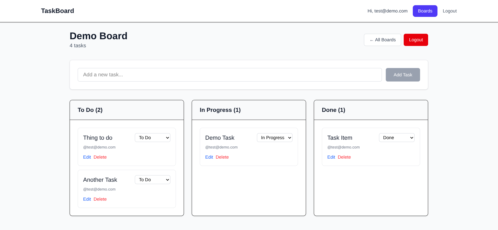

# Real-time Task Board

[](https://www.typescriptlang.org/)
[](https://reactjs.org/)
[](https://nodejs.org/)
[](https://socket.io/)
[](https://mongodb.com/)

Real-time collaborative task board (Trello-style). Multiple users can create boards, add tasks, organize work across columns, and see live updates.

## Live Demo

<a href="https://realtime-task-board-hazel.vercel.app/" target="_blank">View the live app</a>

## Demo Access

A demo account is available for quick access:

**Email:** test@demo.com 
**Password:** TEstDemo1

Account registration may be limited on the live demo to help prevent abuse.

## Preview



## ✨ Features

- 🔐 JWT authentication (register/login)
- 👥 Real-time collaboration via Socket.io with live task updates
- 🧩 Organize tasks across workflow columns (Todo → In Progress → Done)
- 🏗️ TypeScript end-to-end (frontend + backend)
- 🧪 Basic backend/frontend testing setup
- 🐳 Docker Compose ready

## 🏗️ Architecture

```text
┌─────────────────┐    ┌─────────────────────┐    ┌──────────────┐
│   React + TS    │◄──►│ Express + Socket.io │◄──►│   MongoDB    │
│   (Frontend)    │    │         + TS        │    │              │
└─────────────────┘    └─────────────────────┘    └──────────────┘
```

## 🚀 Quick Start

### Prerequisites

- Node.js 18+
- MongoDB (Docker recommended)
- npm or yarn

### 1. Clone & enter project

```bash
git clone https://github.com/therussgarrett/realtime-task-board.git
cd realtime-task-board
```

### 2. Environment

```bash
cp .env.example .env
# Edit .env with your JWT_SECRET, MONGO_URI, ports, etc.
```

### 3. Start MongoDB (Docker)

```bash
docker-compose up -d mongo
```

### 4. Backend

```bash
cd backend
npm install
npm run dev
```

Backend runs on http://localhost:4000

### 5. Frontend

```bash
cd ../frontend
npm install
npm run dev
```

Frontend runs on http://localhost:5173

<br>

## 📁 Project Structure

```text
realtime-task-board/
├── backend/           # Express + Socket.io + TypeScript
├── frontend/          # React + TypeScript + Vite
├── docker-compose.yml
├── .gitignore
├── LICENSE
└── README.md
```

## 🔧 Tech Stack

| Frontend   | Backend    | Database  | Other     |
| ---------- | ---------- | --------- | --------- |
| React 18   | Node.js 20 | MongoDB 7 | Socket.io |
| TypeScript | Express.js | Mongoose  | Docker    |
| Vite       | JWT Auth   |           | ESLint    |

## 🧪 Testing

```bash
cd backend && npm test
cd ../frontend && npm run test
```

## 🎯 Future Enhancements

- [ ] Drag-and-drop task movement
- [ ] Email notifications
- [ ] File attachments
- [ ] Advanced RBAC
- [ ] Redis scaling
- [ ] CI/CD pipeline
- [ ] PWA support

## 🤝 Contributing

1.  Fork the project

2.  Create feature branch: `git checkout -b feature/AmazingFeature`

3.  Commit: `git commit -m "feat: add AmazingFeature"`

4.  Push: `git push origin feature/AmazingFeature`

5.  Open Pull Request

## 📄 License

MIT License – see LICENSE.
